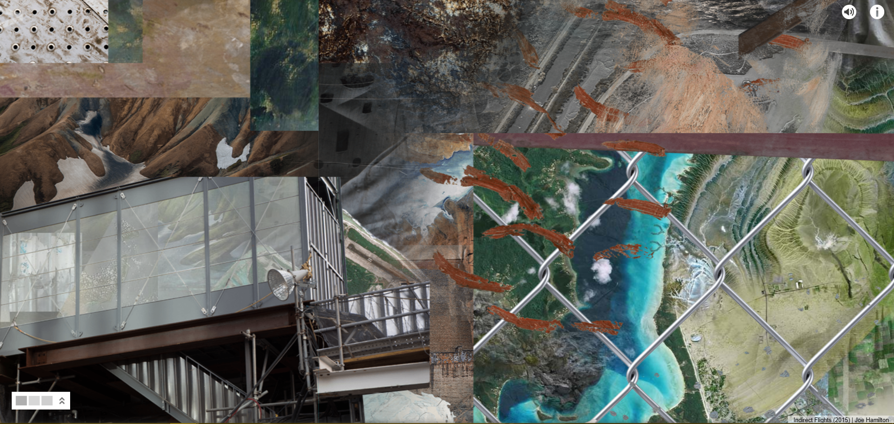
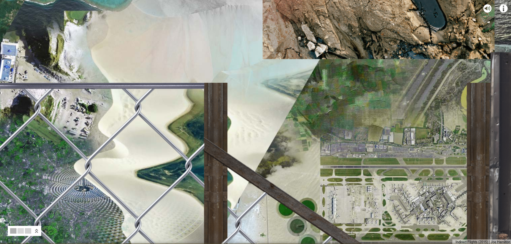
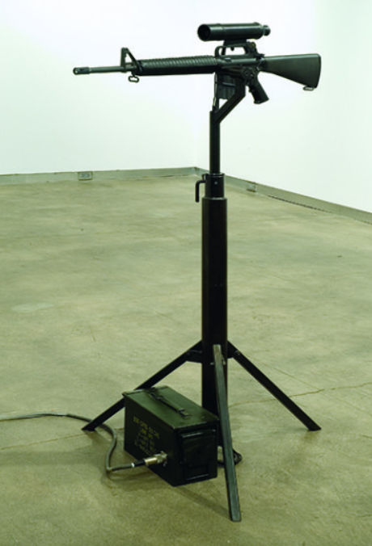

# Week 2 Blog Post
## Ian Hua | Interactive Graphics

### Art Piece 1
Joe Hamilton

Indirect Flights, 2015

I was especially drawn into this piece due to its use of parallax. The juxtaposition of scrapyard material with the earth’s natural environment really brings light to the sheer amount of manmade life existing in the natural beauty of the world. Users are expected to pan throughout the “world,” visiting various architecture, natural terrain, human landscapes, and current day waste. It is very different from a normal piece as you can navigate however you want throughout the piece - the interactivity is very enjoyable as a viewer.

### Art Piece 2
Lynn Hershman

America's Finest, 1994-5

http://www.bitforms.com/hershman-2005/americas-finest

What caught my eye over the rest of the exhibitions in the bitforms gallery is the perched up gun. It is a physical gun and serves no meaning unless you interact with it. Upon pulling the trigger of the M16, the “viewer’s image is superimposed with images of atrocity and war in the gun’s sight,” capturing the the horrible memories that veterans must suffer from during and after their service. This is of course a super interesting piece which further fascinated me due to the unique interaction that the exhibition requires.

