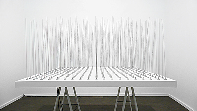

# Week 5 Blog Post
## Ian Hua | Interactive Graphics

### Art Piece 1
Petra Cortright

SLNOW??? 1 & 2, 2011

https://www.petracortright.com/slnows.html

I really enjoyed this piece for a number of reasons. The first is the fact that it is very simplistic and antique-looking. The snow falls very gently and when it hits the bottom it is recycled at the top at a random position. This chance operation creates a new “environment” each time with the same amount of snowflakes on the screen at all times. 

### Art Piece 2
Zimoun

361 prepared dc-motors, filler wire 1.0mm, 2010

This piece stood out to me from Studio Zimoun’s various works. It is different from other works involving “chance operations” because this piece includes the physical element of chance. Since each wire rotates at different timings and the weights of each wire is ever so slightly different, the result is a very elegant work of art. I imagine the wires sticking out as an industrialized version of a wheat or grass field. While most of the Zimoun pieces seem very isolated and desolate, this piece seems to be much more peaceful and soothing to watch and listen.
